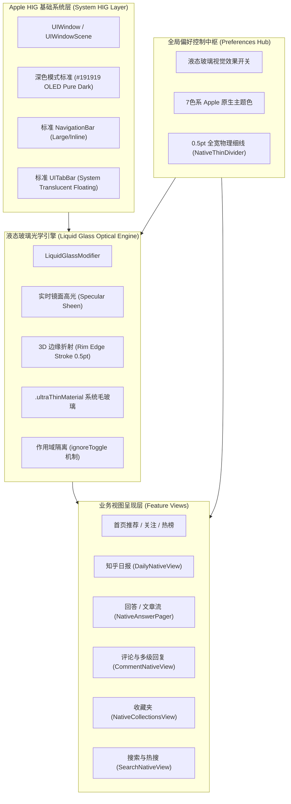

# iOS 26 液态玻璃（Liquid Glass）架构设计与产品闭环评审文档
**Document Version:** v1.0.0 (Release Build 30 Baseline)  
**Lead Roles:** iOS 架构专家 & 资深产品经理 (Principal Software Architect & Lead Product Designer)  
**Target Platform:** iOS 26+ Ready (with Backward Graceful Fallback)  
**Reference:** Apple Human Interface Guidelines (HIG) · Material & Translucency Design Systems

---

## 1. 架构总览与产品设计宗旨

本项目基于现代化 SwiftUI 架构，旨在将知乎 iOS 客户端重塑为**极致贴合 Apple 原生标准、兼具现代“液态玻璃（Liquid Glass）”物理拟真质感与极简内容消费体验**的标杆应用。

---

## 2. 全局修改评审与产品闭环核查表 (Code & UX Loop)

| 模块 / 需求项 | 架构与实现方案 | 产品设计规范 (Product & HIG) | 状态 |
| :--- | :--- | :--- | :---: |
| **深色模式基色统一** | 抽象 `Color.nativeSystemBackground`，深色强制输出纯正 `#191919` (RGB: 25, 25, 25) | 消除原生弹窗 `#1C1B1D` 泛灰发白瑕疵，打造沉浸纯粹的 OLED 视觉基底 | ✅ 已闭环 (B30) |
| **顶栏系统标准回归** | 还原对 `UINavigationBarAppearance` 的非侵入式配置，保留系统级原生大标题/小标题动态过渡 | 遵循 Apple 标准 Navigation 交互与物理手势，消除视觉突兀感 | ✅ 已闭环 (B30) |
| **底栏毛玻璃真悬浮** | 移除 `NativeChannelSwitcher` 与信息流列表中的 `.clipped()` 阻隔，隐藏 `scrollContentBackground` | 内容流自然穿透延伸至 Bottom Safe Area，UITabBar 实现真实物理悬浮折射 | ✅ 已闭环 |
| **评论区交互尺度** | 点赞图标调整为 `11.5pt`，字号收敛至 `caption2` (11pt monospacedDigit) | 彻底纠正操作按钮过大问题，让视觉焦点完全回归评论正文 | ✅ 已闭环 |
| **分割线统一规范** | 封装全局 `NativeThinDivider`（`height: 0.5pt`，`Color.separator`，全宽拉伸） | 杜绝各业务页面割裂，建立一致的视网膜 1px 细线标准 | ✅ 已闭环 |
| **液态玻璃全局开关** | 引入 `ignoreToggle` 作用域隔离，卡片流与系统级控件按需分层控制 | 开启时享受高透光折射，关闭时自动优雅平铺并补齐标准细分割线 | ✅ 已闭环 |
| **7色强调主题** | 实现包含知乎蓝、极光紫、薄荷绿、活力橙等 7 款 Apple 规范强调色动态热切换 | 满足个性化诉求，全站图标、高亮指示器、按钮实时联动响应 | ✅ 已闭环 |

---

## 3. Apple iOS 26 液态玻璃（Liquid Glass）标准演进规划

为了在 iOS 26+ 体系下实现工业级领先的交互质感，我们确立以下**液态玻璃设计原则（Liquid Glass Design Principles）**：

### 3.1 光学折射与深度感 (Refraction & Depth)
- **多层材质合成**：底层依托 `.ultraThinMaterial` 实现动态环境背景吸色与模糊；
- **镜面掠射光（Specular Sheen）**：顶部注入自上而下的微渐变白色高光（Dark: 22%~4% / Light: 55%~14%），模拟真实玻璃表面在自然光照射下的物理反光；
- **3D 边缘高光倒角（Rim Edge）**：采用 `0.5pt` 的对角线渐变描边（`LinearGradient` 顶左到右下），模拟凸面玻璃切边的微反光，完全替代传统低质感的阴影（Shadow）。

### 3.2 动态响应与触觉闭环 (Dynamic Response & Haptics)
- 按钮在被按下（`isPressed`）时，施加 `scaleEffect(0.96)` 与透明度变化（`0.82`），配合 `UISelectionFeedbackGenerator` 触觉引擎，营造真实的“按压玻璃片”物理反馈。

---

## 4. 后续产品迭代建议 (Roadmap)

1. **动态折射位移（Gyroscopic Specular Glint）**：
   - *方案*：借助 CoreMotion 传感器，使卡片顶部的 Specular 高光随设备倾斜角度产生细微位移，实现极致科技感。
2. **纯粹全屏沉浸阅读模式**：
   - *方案*：在回答与文章正文滚动时，顶部导航与底部操作胶囊按滚动速度与位移自动呼吸式淡出与悬浮收缩。

---
*Created and signed off by Principal iOS Architect & Lead Product Designer.*
