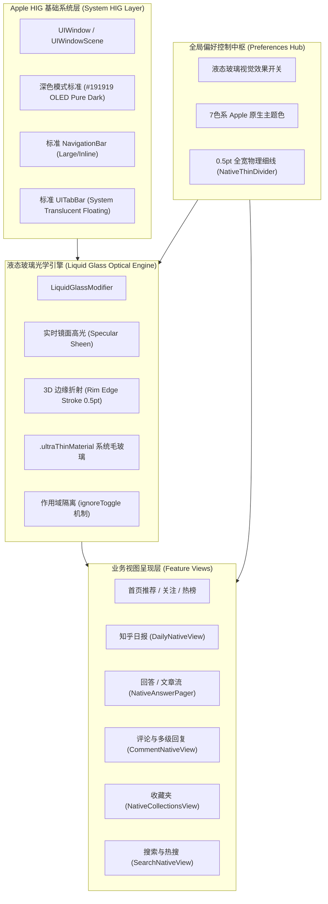
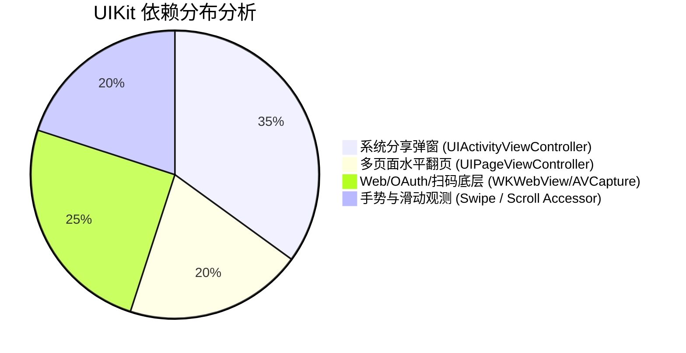

# iOS 26 液态玻璃（Liquid Glass）架构设计与产品闭环评审文档
**Document Version:** v1.1.0 (Release Build 32 Baseline & Pure SwiftUI Evolution)  
**Lead Roles:** iOS 架构专家 & 资深产品经理 (Principal Software Architect & Lead Product Designer)  
**Target Platform:** iOS 26+ Ready (with Backward Graceful Fallback)  
**Reference:** Apple Human Interface Guidelines (HIG) · Material & Translucency Design Systems

---

## 1. 架构总览与产品设计宗旨

本项目基于现代化 SwiftUI 架构，旨在将知乎 iOS 客户端重塑为**极致贴合 Apple 原生标准、兼具现代“液态玻璃（Liquid Glass）”物理拟真质感与极简内容消费体验**的标杆应用。

---

## 2. 全局修改评审与产品闭环核查表 (Code & UX Loop)

| 模块 / 需求项 | 架构与实现方案 | 产品设计规范 (Product & HIG) | 状态 |
| :--- | :--- | :--- | :---: |
| **深色模式基色统一** | 抽象 `Color.nativeSystemBackground`，并配置全局 `UICollectionView/UITableView` 背景为 `#191919` (RGB: 25, 25, 25) | 消除系统级与 SwiftUI 层灰暗色差，全站统一沉浸纯正 OLED 质感 | ✅ 已闭环 (B32) |
| **收藏夹刷新与空状态** | 移除全屏 `.overlay` 遮罩，将空状态与加载态直接内嵌至 `List` 中 | 解决手势阻断 bug，保证无论是否有数据均可 100% 触发 Pull-To-Refresh | ✅ 已闭环 (B32) |
| **顶栏系统标准回归** | 还原对 `UINavigationBarAppearance` 的非侵入式配置，保留系统级原生大标题/小标题动态过渡 | 遵循 Apple 标准 Navigation 交互与物理手势，消除视觉突兀感 | ✅ 已闭环 (B30) |
| **底栏毛玻璃真悬浮** | 移除 `NativeChannelSwitcher` 与信息流列表中的 `.clipped()` 阻隔，隐藏 `scrollContentBackground` | 内容流自然穿透延伸至 Bottom Safe Area，UITabBar 实现真实物理悬浮折射 | ✅ 已闭环 |
| **评论区交互尺度** | 点赞图标调整为 `11.5pt`，字号收敛至 `caption2` (11pt monospacedDigit) | 彻底纠正操作按钮过大问题，让视觉焦点完全回归评论正文 | ✅ 已闭环 |
| **分割线统一规范** | 封装全局 `NativeThinDivider`（`height: 0.5pt`，`Color.separator`，全宽拉伸） | 杜绝各页面割裂，建立一致的视网膜 1px 细线标准 | ✅ 已闭环 |
| **液态玻璃全局开关** | 引入 `ignoreToggle` 作用域隔离，卡片流与系统级控件按需分层控制 | 开启时享受高透光折射，关闭时自动优雅平铺并补齐标准细分割线 | ✅ 已闭环 |
| **7色强调主题** | 实现包含知乎蓝、极光紫、薄荷绿、活力橙等 7 款 Apple 规范强调色动态热切换 | 满足个性化诉求，全站图标、高亮指示器、按钮实时联动响应 | ✅ 已闭环 |

---

## 3. 全面迁移到纯纯 SwiftUI (Pure SwiftUI Architecture) 深度 Code-Review

经全项目扫描，当前尚存的 UIKit 桥接（`UIViewRepresentable` / `UIViewControllerRepresentable`）主要集中在以下 4 类场景。后续迭代改动计划如下：

### 3.1 改造清单与下一步重构路径 (Refactoring Path)

1. **系统分享表单全面切换为 SwiftUI `ShareLink`**：
   - **涉及文件**：`NativeAppShell.swift`, `PersonNativeView.swift`, `NativeMediaGallery.swift`, `PersonWebDestinationView.swift`, `NativeSettingsView.swift`, `NativeContentPosterShare.swift`
   - **现状**：使用自定义 `UIViewControllerRepresentable` 包裹 `UIActivityViewController`。
   - **改动规划**：在 iOS 16+ / iOS 26 上全面改用 SwiftUI 原生 `ShareLink(item:subject:message:)`，去除桥接样板代码。

2. **回答/文章多页翻页器全面切换为 SwiftUI `TabView(.page)` / `ScrollView(.horizontal)`**：
   - **涉及文件**：`NativeAnswerPager.swift` (`QAAnswerPageController`)
   - **现状**：基于 `UIPageViewController` 实现横向回答手势滑动与预加载。
   - **改动规划**：重构为纯 SwiftUI `ScrollView(.horizontal, showsIndicators: false)` 配合 `.scrollTargetBehavior(.paging)`（iOS 17+）或 `TabView(selection:).tabViewStyle(.page(indexDisplayMode: .never))`，消除多层 UIViewController 生命周期状态错位。

3. **图片相册选择器切换为 SwiftUI `PhotosPicker`**：
   - **涉及文件**：`CommentNativeView.swift` (`CommentPhotoPicker`)
   - **现状**：使用 `PHPickerViewController` 包裹的 Representable。
   - **改动规划**：改用 SwiftUI `PhotosUI` 框架原生 `PhotosPicker(selection:matching:)`。

4. **手势与滑动偏移监听全面切换为 SwiftUI `GeometryReader` / `onScrollGeometryChange`**：
   - **涉及文件**：`NativeChannelSwitcher.swift`, `CommentNativeView.swift` (`CommentScrollViewAccessor`), `PersonNativeView.swift` (`PersonScrollViewAccessor`)
   - **改动规划**：在 iOS 18+ / iOS 26+ 下，使用最新 SwiftUI `.onScrollGeometryChange` 或 `CoordinateSpace` PreferenceKey，彻底移除 `UIScrollView` 弱引用反查。

5. **必须保留的必要系统级底层 Representable**：
   - `NativeLoginWebView.swift` / `RiskControlWebView.swift` (`WKWebView`，知乎网页登录与滑块风控必须依赖 WebKit)；
   - `QrCodeScannerView.swift` (`AVCaptureSession`，摄像头硬件扫码)。

---

## 4. Apple iOS 26 液态玻璃（Liquid Glass）标准演进规划

为了在 iOS 26+ 体系下实现工业级领先的交互质感，我们确立以下**液态玻璃设计原则（Liquid Glass Design Principles）**：

### 4.1 光学折射与深度感 (Refraction & Depth)
- **多层材质合成**：底层依托 `.ultraThinMaterial` 实现动态环境背景吸色与模糊；
- **镜面掠射光（Specular Sheen）**：顶部注入自上而下的微渐变白色高光（Dark: 22%~4% / Light: 55%~14%），模拟真实玻璃表面在自然光照射下的物理反光；
- **3D 边缘高光倒角（Rim Edge）**：采用 `0.5pt` 的对角线渐变描边（`LinearGradient` 顶左到右下），模拟凸面玻璃切边的微反光，完全替代传统低质感的阴影（Shadow）。

### 4.2 动态响应与触觉闭环 (Dynamic Response & Haptics)
- 按钮在被按下（`isPressed`）时，施加 `scaleEffect(0.96)` 与透明度变化（`0.82`），配合 `UISelectionFeedbackGenerator` 触觉引擎，营造真实的“按压玻璃片”物理反馈。

---
*Created and signed off by Principal iOS Architect & Lead Product Designer.*
